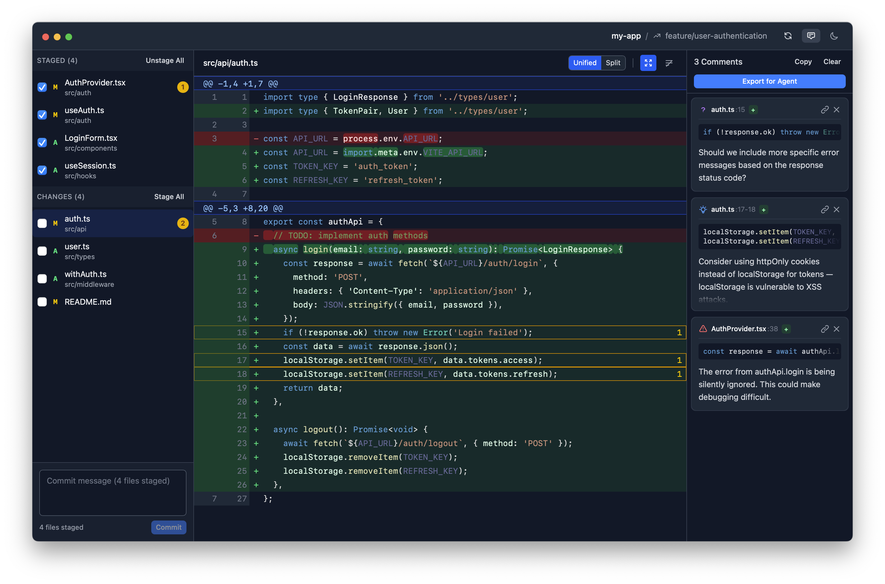

<p align="center">
  
</p>

# revu

A desktop Git diff reviewer with inline commenting, designed for local code review workflows with AI coding agents.

<p align="center">
  
</p>

## Why revu?

AI coding agents like Claude Code, OpenCode, and Codex work directly in your local environment - modifying files in real-time before any commit or push. Traditional GitHub PR reviews don't fit this workflow. You need to review changes _locally_, provide feedback, and guide the agent's next turn.

revu bridges this gap: a desktop review interface that exports structured feedback agents can consume.

Inspired by [Conductor](https://www.conductor.build/)'s working directory review feature.

## Features

- **Unified and split diff views** - syntax highlighting with word-level change detection
- **Inline comments** - click any line to add categorised feedback
- **Stage/unstage files** - manage staging and create commits directly
- **Send to Agent** - exports structured review to `.revu` for agent consumption
- **CLI integration** - open with a repo path: `open -a revu --args /path/to/repo`
- **Light/dark theme** - with system preference detection
- **Keyboard shortcuts** - Cmd+R refresh, Cmd+Shift+C copy review, Cmd+Enter commit

## Comment Categories

| Category       | Colour | Meaning                                     |
| -------------- | ------ | ------------------------------------------- |
| **issue**      | Red    | Bug or error - must be fixed                |
| **suggestion** | Blue   | Improvement - implement unless problematic  |
| **question**   | Purple | Clarification needed - agent should explain |
| **nitpick**    | Yellow | Minor preference - fix if easy              |
| **praise**     | Green  | Positive feedback - no change needed        |

## Installation

### Homebrew (Recommended)

```bash
brew install eddmann/tap/revu
```

### Manual Download

Download the latest release from [GitHub Releases](https://github.com/eddmann/revu/releases):

- **macOS:** `.dmg` (Apple Silicon and Intel)
- **Linux:** `.AppImage` or `.deb`

### Build from Source

```bash
git clone https://github.com/eddmann/revu.git
cd revu
bun install
bun run tauri build

# Copy to Applications (macOS)
cp -r src-tauri/target/release/bundle/macos/revu.app /Applications/
```

## Usage

### Standalone

Open revu and browse to a Git repository, or launch from the command line:

```bash
open -a revu --args /path/to/your/repo
```

### With Coding Agents

revu includes an installable skill for agent integration.

**Install the skill:**

```bash
# For Claude Code
mkdir -p ~/.claude/skills/revu
cp SKILL.md ~/.claude/skills/revu/

# For other agents, copy SKILL.md to your agent's skills directory
```

**Workflow:**

1. Run `/revu` in your agent
2. revu opens with your repo
3. Review changes and add comments by clicking on lines
4. Click "Send to Agent" when done
5. Run `/revu` again to retrieve the review

The review is saved to `.revu` in your project root.

## Review Format

When you click "Send to Agent", revu writes a structured XML file that agents can parse:

```xml
<revu-review>
<review-summary>
Total: 3 comments
Action required: 2 (1 issue, 1 suggestion)
</review-summary>

<comment id="1">
<file>src/App.tsx</file>
<line>42</line>
<side>new</side>
<category>issue</category>
<code language="tsx">
const value = props.data
</code>
<text>This will crash if props.data is undefined</text>
</comment>
</revu-review>
```

## Development

```bash
git clone https://github.com/eddmann/revu.git
cd revu
make install    # Install dependencies
make dev        # Start development server
make build      # Build production app
make fmt        # Format all code
make lint       # Run linting checks
```

**Prerequisites:**
- Bun
- Rust toolchain
- Tauri CLI (`bun add -g @tauri-apps/cli`)

## Tech Stack

React 19, TypeScript, Tailwind CSS 4, Zustand, Tauri 2, Rust, libgit2, Vite 7, Bun

## License

[MIT](LICENSE)
